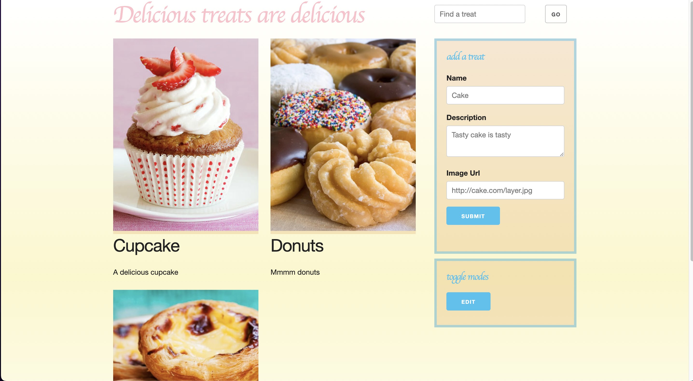

# Full Stack Treats

## Description

This is a code challenge treats application that was built by Prime Digital Academy. I corrected the Express routes to finish the project.

## Interface

## Languages

JavaScript, CSS, HTML, Postgresql, and Markdown demonstrated.

## Packages

This is built using Node.js with Express, Pg, Nodemon, and jQuery utilized.

## Future Updates

There will be no future updates.
